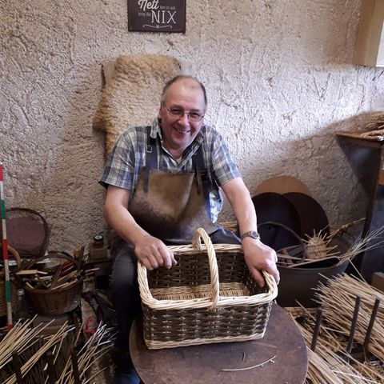
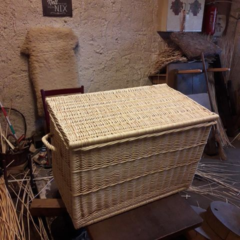
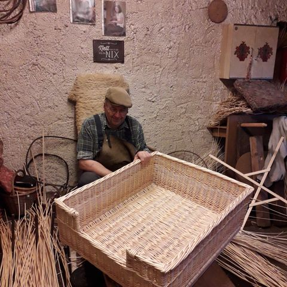
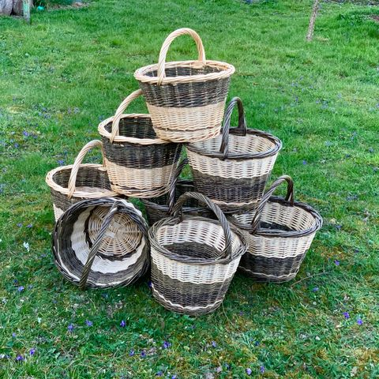

## Neue Produkte

  

    
  

  

    <h2>Norfolk Spargelkorb</h2>
    

      Ein Korb, der im Vereinigten Königreich für die Spargelernte benötigt wurde und seinen Ursprung in der Grafschaft Norfolk hat. In meiner Werkstatt nach Englischen Maßen und in Englischer Technik geflochten. Für jeden Hobbygärtner die Gelegenheit, mit einem schönen Begleiter die Ernte zu erledigen. Und das nicht nur in der Spargelzeit.  Auch gut als Werkzeugkorb einsetzbar. Länge ca. 47cm, Breite ca. 30cm, Höhe ohne Henkel ca. 20-21cm
    

  

 

  

    
  

  

    <h2>Korbtruhe, weiße Weide</h2>
    

      Korbtruhen flechte ich auf Bestellung in den gewünschten Maßen. Bei Interesse einfach anfragen. Ich erstelle dann gerne ein individuelles Angebot. 
    

  

 

  

    
  

  

    <h2>Hundekorb für einen ganz besonderen Freund des Menschen</h2>
    

      Auch so etwas machen wir, wenn es gewünscht wird. 
    

  

 

  

    
  

  

    <h2>15-Pfünder in "Rheinland Grün-Weiß"</h2>
    

      Nicht immer vorrätig, sondern nur, wenn aus der laufenden Fertigung die benötigten Weiden dafür "übrig" sind.  Bitte bei Interesse einfach nachfragen. Wir helfen gerne weiter.
    

  

