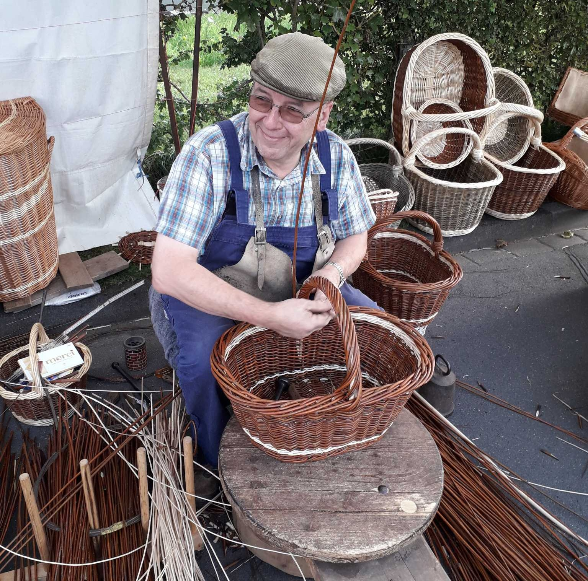
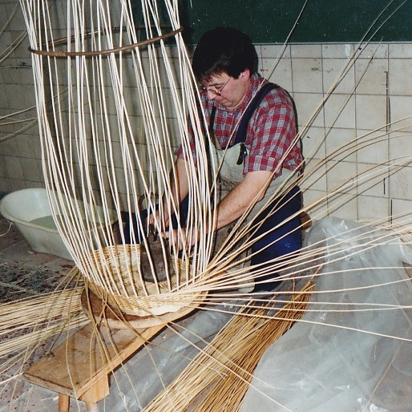
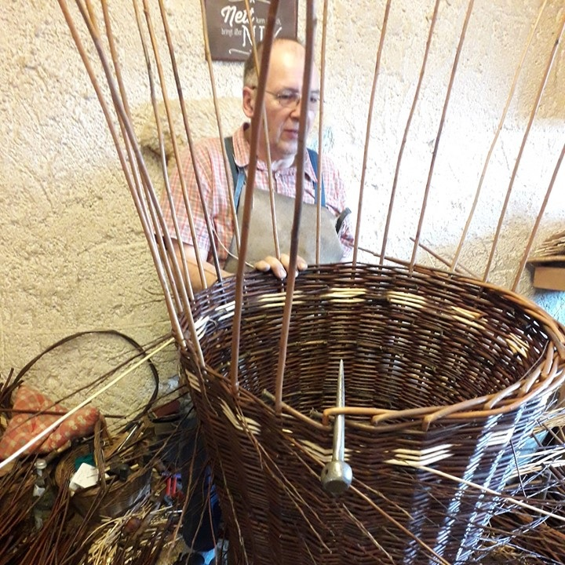
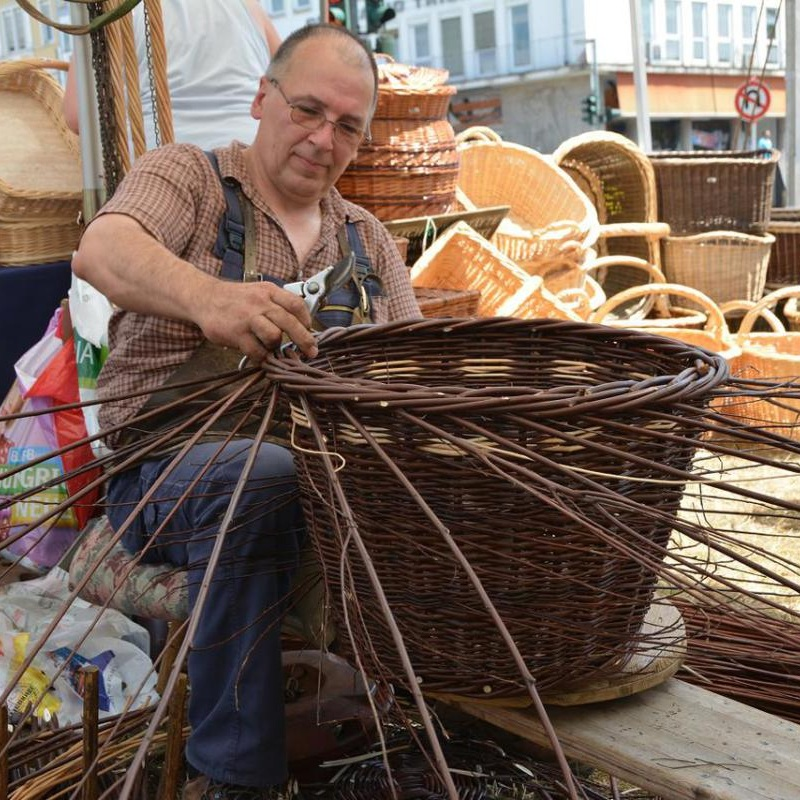

  

    
  

  

    <h2>Über uns</h2>
    

      Seit 1984 betreibe ich mit meiner Frau in Mückeln im Haupterwerb unsere Werkstatt als Meister- und Innungsbetrieb des Korbmacherhandwerks. Obwohl wir uns weniger als Kunst- denn als Gebrauchshandwerk verstehen, wollen wir unseren Kunden ein Produkt anbieten, das bei voller Gebrauchsfähigkeit und hoher Verarbeitungsqualität auch ästhetische Ansprüche erfüllt. Und dies zu bezahlbaren Preisen. Wir freuen uns auf Sie!  → Direkt zum <a href="assets/files/Katalog2025.pdf">Katalog</a>
    

  

 
 

## Wie die Zeit vergeht

  

    
    
Arbeitsprobe bei der Meisterprüfung 1994

  

  

    
    
Herstellung eines großen Spreukorbes (Kaffmange)

  

  

    
    
"Außeneinsatz" auf dem Handwerkermarkt in Trier

  

